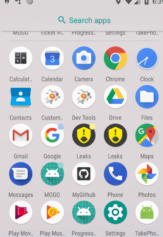

[  ](https://bintray.com/vegen/OpenCode/ProgressBar/_latestVersion)

## 使用

```
implementation compile 'com.vegen.open:ProgressBar:+'
```
`其中 '+' 请填写版本号 Download 后的最新版本`

## 使用示例
布局
```
<LinearLayout xmlns:android="http://schemas.android.com/apk/res/android"
    xmlns:app="http://schemas.android.com/apk/res-auto"
    xmlns:tools="http://schemas.android.com/tools"
    android:layout_width="match_parent"
    android:layout_height="match_parent"
    tools:context=".MainActivity"
    android:gravity="center"
    android:orientation="vertical">

    <com.vegen.open.library.ProgressBar
        android:id="@+id/spliceProgressBar"
        android:layout_width="150dp"
        android:layout_height="150dp"
        app:showPattern="percentSplice"
        app:progress_width="8dp"
        android:layout_centerInParent="true"/>

    <com.vegen.open.library.ProgressBar
        android:layout_marginTop="10dp"
        android:id="@+id/coverProgressBar"
        android:layout_width="150dp"
        android:layout_height="150dp"
        app:showPattern="percentCover"
        app:cover_bg_start_color="#F2F5F9"
        app:cover_end_color="#4FACFE"
        app:cover_start_color="#4FACFE"
        app:cover_mid_color="#00F2FE"
        app:progress_width="8dp"
        android:layout_centerInParent="true"/>

</LinearLayout>
```
分块模式的配置
```
private void initSpliceProgressBar(){
        final List<TextWithStyle> spliceTextWithStyleList = new ArrayList<>();
        TextWithStyle text1 = new TextWithStyle("测试1：￥166", 14f, 0xFF2B78F6, 166f / (166 + 66 + 36));
        spliceTextWithStyleList.add(text1);
        TextWithStyle text2 = new TextWithStyle("测试2：￥66", 14f, 0xFFF5C900, 66f / (166 + 66 + 36));
        spliceTextWithStyleList.add(text2);
        TextWithStyle text3 = new TextWithStyle("测试3：￥36", 14f, new int[]{0xFF4FACFE, 0xFF00F2FE}, 36f / (166 + 66 + 36));
        spliceTextWithStyleList.add(text3);

        spliceProgressBar.setSpliceAdapter(new ProgressBarSpliceAdapter() {
            @Override
            public List<TextWithStyle> getTextList() {
                return spliceTextWithStyleList;
            }

            @Override
            public float getLineSpace() {
                return 10;
            }

            @Override
            public boolean isShowDotFront() {
                return true;
            }

            @Override
            public int getTextGravity() {
                return ProgressBarCoverAdapter.TEXT_GRAVITY_LEFT;
            }

            @Override
            public int getStartAngle() {
                return 90;
            }
        });
```

覆盖模式的配置
```
private void initCoverProgressBar(){

        final List<TextWithStyle> coverTextWithStyleList = new ArrayList<>();

        TextWithStyle text1 = new TextWithStyle("已用：￥80.8", 16f, new int[]{0xFF4FACFE, 0xFF00F2FE});
        coverTextWithStyleList.add(text1);
        TextWithStyle text2 = new TextWithStyle("未用：￥20", 14f, 0xFFBBC2CC);
        coverTextWithStyleList.add(text2);

        coverProgressBar.setCoverAdapter(new ProgressBarCoverAdapter() {
            @Override
            public List<TextWithStyle> getTextList() {
                return coverTextWithStyleList;
            }

            @Override
            public float getLineSpace() {
                return 10;
            }

            @Override
            public boolean isShowDotFront() {
                return true;
            }

            @Override
            public int getStartAngle() {
                return (int) (180 + (1 - getProgressPercent()) / 2f * 360);
            }

            @Override
            public float getProgressPercent() {
                return 80f / (80 + 20);
            }

            @Override
            public int getTextGravity() {
                return ProgressBarCoverAdapter.TEXT_GRAVITY_CENTER;
            }
        });
    }
```

> 主要是配置好对应模式的 Adapter，使用相当简单

demo 效果如下


## 相关属性

| **属性名称**  | **意义** | **类型** | **默认值** |
| --- | --- | --- | --- |
| showPattern | 进度条显示模式 percentCover（默认）：按百分比上层覆盖下层模式，percentSplice：按百分比色块接拼组合模式 | enum | percentCover |
| progress_width | 进度宽度 | dimension | 8f |
| start_angle | 起始角度 | integer | mShowPattern == PATTERN_PERCENT_COVER ? (int) (180 + (1 - mProgressPercent) * mSweepAngle * 2) : 0 |
| cover_start_color | 进度起始色 | color | Color.YELLOW |
| cover_mid_color | 进度中间色 | color | cover_start_color |
| cover_end_color | 进度结束色 | color | cover_start_color |
| cover_bg_start_color | 背景起始色 | color | Color.LTGRAY |
| cover_bg_mid_color | 背景中间色 | color | cover_bg_start_color |
| cover_bg_end_color | 背景结束色 | color | cover_bg_start_color |
| cover_percent | 进度值 介于0-1 | float | 0f |
| cover_sweep_angle | 扫过的角度 | integer | 360 |
| cover_stroke_cap | 是否圆帽显示 | boolean | false |
